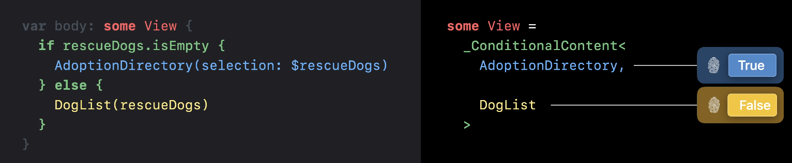

# Demisty SwiftUI

### 👉 Intro
- SwiftUI는 선언형 UI 프레임워크 (ex HTML, CSS, SQL 등) How가 아닌 What
- identity
  > 앱이 업데이트 될 때 elements를 같은 것으로 인식하는지 혹은 구별하는지에 대한 방법
- lifetime
  > 시간의 흐름에 따라 어떻게 뷰와 데이터의 존재 여부를 추적하는지에 관한 것
- dependencies
  > 인터페이스가 언제 업데이트를 필요로 하며 왜 업데이트를 필요로 하는지
- identify, lifetime, dependencies는 "무엇을", "언제", "어떻게" 변경해야 하는가를 나타내며 최종적으로 사용자에게 동적인 인터페이스를 제공할 수 있음

### 💳 View Identity
- 겉으로 보기에 동일한 두 개의 사물을 찍은 사진이 있다고 하자. 이때 이 사진 속 사물은 같은 사물일까? 아니면 동일한 사물을 찍은 두 장의 사진일까? 각 사물을 구분하는 고유 값 그것이 Identity의 핵심
- SwiftUI에서는 다른 상태(state)에 있는 뷰들이 identity라는 것으로 연결되어 있음. 같은 개념적 UI 요소의 다른 상태를 나타내기 위해서 같은 ID를 공유함
- same identity == same element : 같은 개념적 UI 요소의 다른 상태를 나타내기 위해서 같은 ID를 공유함
- different identities == distinct element : 구별되는 UI (다른 UI)인 경우 다른 아이디 값을 가짐
- explicit(명시적인, 뚜렷한) <-> implicit(절대적인, 암시적인)

#### ✅ Explicit identity
- SwiftUI는 참조가 아닌 값 타입이기 때문에 사용할 수 있는 고유 참조값이 없음. (UIKist은 각 View가 참조값을 가지고 있기 때문에 만일 두 개의 뷰가 동일한 지 확인하려면 참조값을 비교하면 됨)

~~~Swift
Section {
    ForeEach(users, id:\.userID) { user in
        ListRowView(id)
    }
}
~~~
- id 파라미터로 전달한 고유값은 각 뷰를 명시적으로 구분할 수 있게 함
- 섹션내에서 해당 뷰를 이동 시키더라도 SwiftUI는 ID를 사용해서 무엇이 변경되었는지 파악하고 애니메이션을 수행할 수 있음
``` Swift
ScrollViewReader { proxy in
  ScrollView {
    HeaderView(header)
      .id(headerID)

      // .. 생략
      Button("위로 이동하기") {
        withAnimation {
          proxy.scrollTo(headerID)
        }
      }
  }
}
```
- 명시적안 ID를 사용해서 특정 View에 ID를 지정. ScrollView에게 특정 View로 이동할 것을 알리기 위해 ID를 전달
- 이 방법은 모든 View에 대해 알 필요가 없음. 다른 곳에서 식별이 필요한 뷰에만 명시적은 ID를 지정하면 됨.


#### ✅ Structural Identity
``` Swift
ScrollViewReader { proxy in
  ScrollView {
    HeaderView(header)
      .id(headerID)

      // .. 생략
      Button("위로 이동하기") {
        withAnimation {
          proxy.scrollTo(headerID)
        }
      }
  }
}
```
- 위 코드에서 Button이나 코드에서 생략된 부분에 존재하는 View들이 명시적인 ID를 가지고 있지 않다 할지라도 ID를 가지지 않은 것은 아님
> Because every view has an identity, even if it's not explicit Identity.
- SwiftUI는 뷰 계층 구조를 사용하여 암묵적인 ID를 생성하므로 개발자가 직접 ID를 생성할 필요가 없음
```Swift
        if let userName = userName {
            UserInfoView(userName: .constant(userName)) // True View
        } else {
            NoUserView() // False View
        }
```
- SwiftUI는 뷰 계층 구조를 확인하여 View를 구별함
- 이 경우 두개의 View가 동일하게 생겼다 할 지라도 if 조건문에 의해 정해진 위치에 정해진 뷰가 위치하므로 구별가능 함
- 각 true, false 조건에 해당하는 뷰를 지정하는 경우는 각 조건일 때 뷰가 이동없이 정적인 경우에만 사용가능하게 됨
```Swift
some View = 
  _ConditionalContent<
    UserInfoView,

    NoUserView
  >
```
- SwiftUI 의 result builder인 ViewBuilder에 의해 if statement는 _ConfitionalContent로 변경됨
- View protocol이 ViewBuilder 에 있는 body property를 감싸고, ViewBuilder는 if statement문 안에서 단일 일반 뷰를 생성함
- var body의 리턴 타입인 some View는 코드가 복잡해지지 않게 하면서도 generic 타입을 사용할 수 있게 해줌. true일 때는 UserInfoView로 false일 때는 NoUserView가 반환된다는 것을 보장함 -> 암시적이고 안정적인 ID를 할당할 수 있게 됨

```Swift
    var body: some View {
        UserInfoView(userName: .constant(userName ?? "no user"))
    }
```
- 각각 다른 고유의 뷰로 인식하기 때문에 둘 사이의 애니메이션이 매끄럽지 못함
```Swift
    var body: some View {
        UserInfoView(userName: .constant(userName ?? "no user"))
    }
```