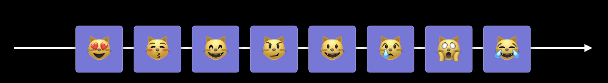
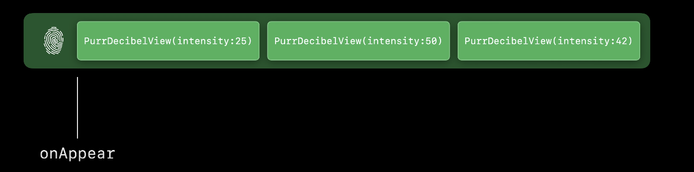
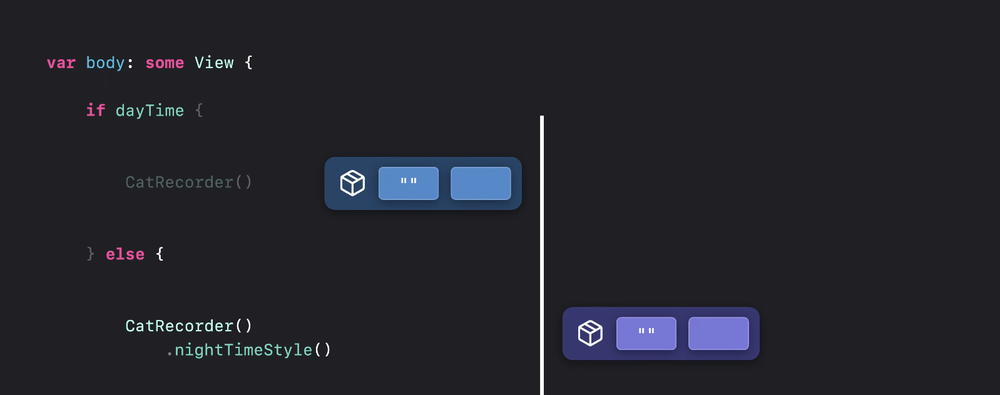
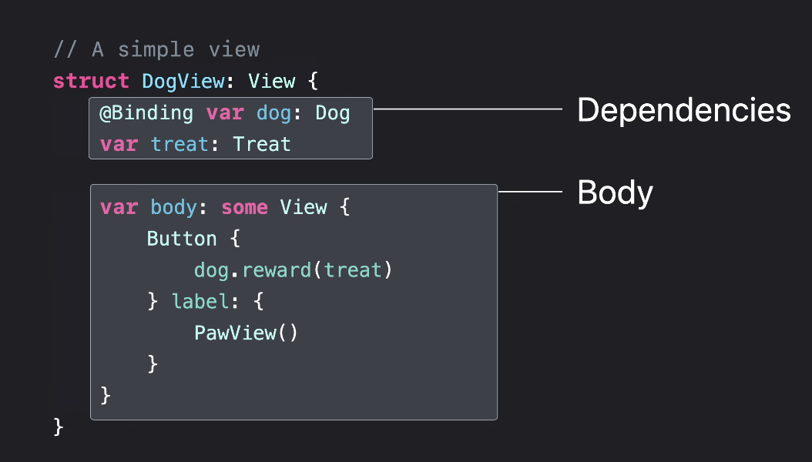
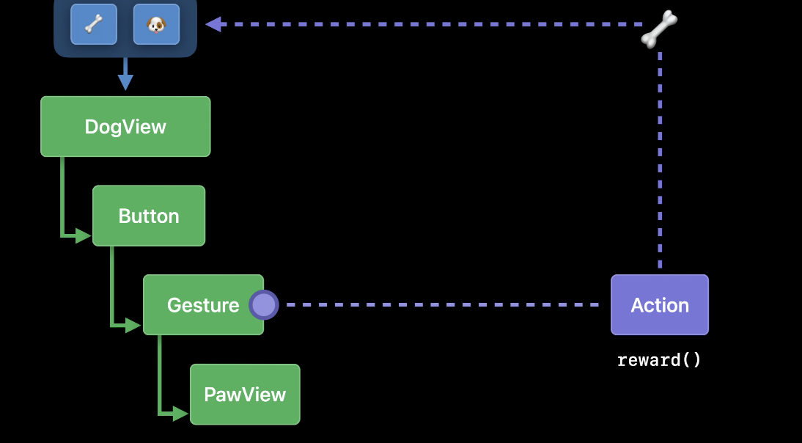
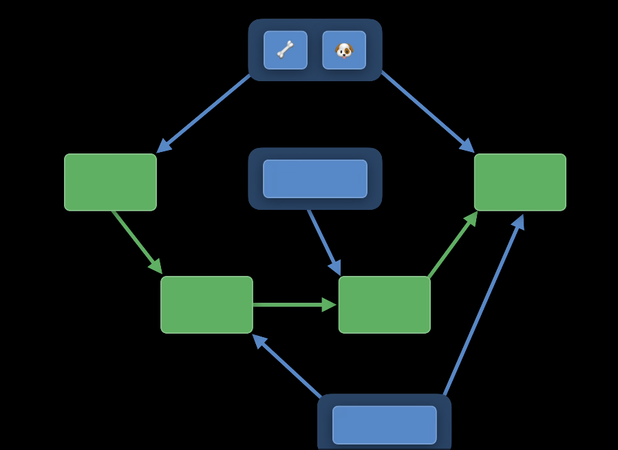
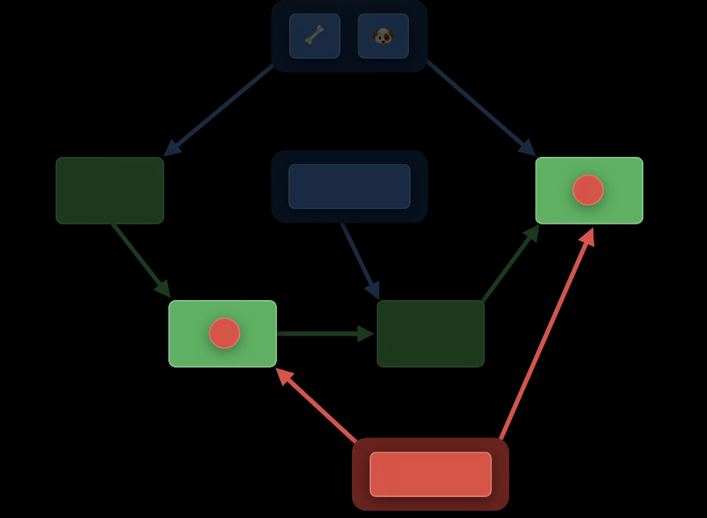
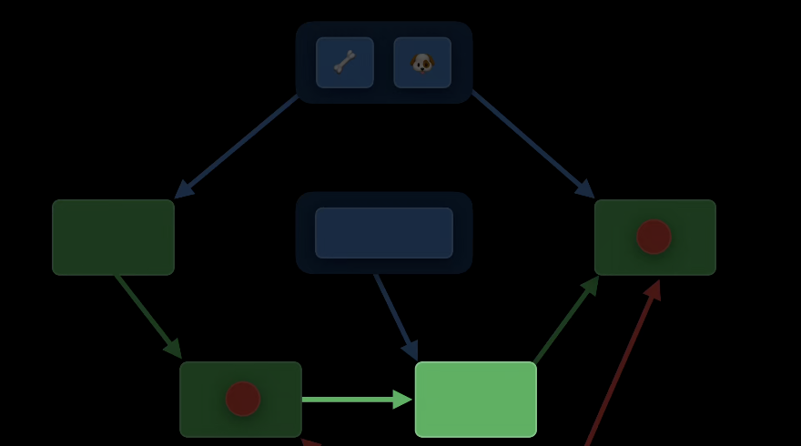

# Demisty SwiftUI

### 👉 Intro
- SwiftUI는 선언형 UI 프레임워크 (ex HTML, CSS, SQL 등) How가 아닌 What
- identity
  > 앱이 업데이트 될 때 elements를 같은 것으로 인식하는지 혹은 구별하는지에 대한 방법
- lifetime
  > 시간의 흐름에 따라 어떻게 뷰와 데이터의 존재 여부를 추적하는지에 관한 것
- dependencies
  > 인터페이스가 언제 업데이트를 필요로 하며 왜 업데이트를 필요로 하는지
- identify, lifetime, dependencies는 "무엇을", "언제", "어떻게" 변경해야 하는가를 나타내며 최종적으로 사용자에게 동적인 인터페이스를 제공할 수 있음

### 💳 View Identity
- 겉으로 보기에 동일한 두 개의 사물을 찍은 사진이 있다고 하자. 이때 이 사진 속 사물은 같은 사물일까? 아니면 동일한 사물을 찍은 두 장의 사진일까? 각 사물을 구분하는 고유 값 그것이 Identity의 핵심
- SwiftUI에서는 다른 상태(state)에 있는 뷰들이 identity라는 것으로 연결되어 있음. 같은 개념적 UI 요소의 다른 상태를 나타내기 위해서 같은 ID를 공유함
- same identity == same element : 같은 개념적 UI 요소의 다른 상태를 나타내기 위해서 같은 ID를 공유함
- different identities == distinct element : 구별되는 UI (다른 UI)인 경우 다른 아이디 값을 가짐
- explicit(명시적인, 뚜렷한) <-> implicit(절대적인, 암시적인)

#### ✅ Explicit identity
[뷰의 ID를 데이터에 연결하거나 특정 뷰를 참조하는 사용자 지정 식별자를 제공]
- SwiftUI는 참조가 아닌 값 타입이기 때문에 사용할 수 있는 고유 참조값이 없음. (UIKist은 각 View가 참조값을 가지고 있기 때문에 만일 두 개의 뷰가 동일한 지 확인하려면 참조값을 비교하면 됨)

~~~Swift
Section {
    ForeEach(users, id:\.userID) { user in
        ListRowView(id)
    }
}
~~~
- id 파라미터로 전달한 고유값은 각 뷰를 명시적으로 구분할 수 있게 함
- 섹션내에서 해당 뷰를 이동 시키더라도 SwiftUI는 ID를 사용해서 무엇이 변경되었는지 파악하고 애니메이션을 수행할 수 있음
``` Swift
ScrollViewReader { proxy in
  ScrollView {
    HeaderView(header)
      .id(headerID)

      // .. 생략
      Button("위로 이동하기") {
        withAnimation {
          proxy.scrollTo(headerID)
        }
      }
  }
}
```
- 명시적안 ID를 사용해서 특정 View에 ID를 지정. ScrollView에게 특정 View로 이동할 것을 알리기 위해 ID를 전달
- 이 방법은 모든 View에 대해 알 필요가 없음. 다른 곳에서 식별이 필요한 뷰에만 명시적은 ID를 지정하면 됨.


#### ✅ Structural Identity
[뷰 계층 구조 내에서 뷰의 유형과 위치만으로 뷰를 식별하는 방법]
``` Swift
ScrollViewReader { proxy in
  ScrollView {
    HeaderView(header)
      .id(headerID)

      // .. 생략
      Button("위로 이동하기") {
        withAnimation {
          proxy.scrollTo(headerID)
        }
      }
  }
}
```
- 위 코드에서 Button이나 코드에서 생략된 부분에 존재하는 View들이 명시적인 ID를 가지고 있지 않다 할지라도 ID를 가지지 않은 것은 아님
> Because every view has an identity, even if it's not explicit Identity.
- SwiftUI는 뷰 계층 구조를 사용하여 암묵적인 ID를 생성하므로 개발자가 직접 ID를 생성할 필요가 없음
```Swift
        if let userName = userName {
            UserInfoView(userName: .constant(userName)) // True View
        } else {
            NoUserView() // False View
        }
```
- SwiftUI는 뷰 계층 구조를 확인하여 View를 구별함
- 이 경우 두개의 View가 동일하게 생겼다 할 지라도 if 조건문에 의해 정해진 위치에 정해진 뷰가 위치하므로 구별가능 함
- 각 true, false 조건에 해당하는 뷰를 지정하는 경우는 각 조건일 때 뷰가 이동없이 정적인 경우에만 사용가능하게 됨
```Swift
some View = 
  _ConditionalContent<
    UserInfoView,

    NoUserView
  >
```
- SwiftUI 의 result builder인 ViewBuilder에 의해 if statement는 _ConfitionalContent로 변경됨
- View protocol이 ViewBuilder 에 있는 body property를 감싸고, ViewBuilder는 if statement문 안에서 단일 일반 뷰를 생성함
- var body의 리턴 타입인 some View는 코드가 복잡해지지 않게 하면서도 generic 타입을 사용할 수 있게 해줌. true일 때는 UserInfoView로 false일 때는 NoUserView가 반환된다는 것을 보장함 -> 암시적이고 안정적인 ID를 할당할 수 있게 됨


- 각각 다른 고유의 뷰로 인식하기 때문에 둘 사이의 애니메이션이 매끄럽지 못함
```Swift
    var body: some View {
        UserInfoView(userName: .constant(userName ?? "no user"))
    }
```
- SwiftUI에서는 이 경우 단일 뷰 (Single View)를 사용하고 modifier나 값으로 전달하는 것을 추천함
- 조건으로 뷰를 지정했을 때 보다 더 유연한 transition을 제공하며 id를 보존 시킬 수 있음
- view의 lifetime과 state를 보존할 수 있음

#### ✨ AnyView
- 되도록 AnyView 사용을 지양함
- 코드륵 읽거나 이해하기 어렵게 만듬
- if/else 혹은 Switch를 사용해서 뷰를 쉽게 설정 가능함 (AnyView 말고 기본적으로 제공하는 조건 문 사용해라.)
- AnyView는 타입에 대한 정보를 숨기기 때문에 컴파일러가 오류를 표시 하지 않을 수 있음
- 필요하지 않을 때 AnyView를 맹목적으로 사용하게 되면 퍼포먼스 저하됨

> - Makes code harder to understand
> - Fewer compile-time diagnostics
> - Worse performance when not needed

----

### ⏰ LifeTime

- 동일한 고양이이지만 시간이 흐름에 따라 고양이는 움직여 위치를 바꾸고 졸거나 울거나 밥을 먹는 등의 변화가 나타난다. 하지만 동일한 고양이라는 것은 변함없음
- 위와 마찬가지로 lifetime 동안 동일한 View가 상태와 위치를 바꾸게 됨
- identity를 사용하면 시간이 지남에 따라 다양한 값에 대해 stable element를 정의할 수 있음

- View가 화면에 나타나면 SwiftUI는 identity를 할당함. 이후 View의 값의 변화가 있더라도 SwiftUI는 같은 뷰로 인식함. 
> view value != view identity
- view 의 value는 lifetime 동안 값이 변화하기 때문에 view의 고유값이라고 생각하면 안됨
- 뷰의 수명 == 해당 뷰와 연결된 ID의 지속 시간을 의미함
> A view's lifetime is the duration of the identity.
- identity는 상태 지속성에도 영향을 미침

- ID가 변경될때마타 상태도 변경됨
- if/else statement에서 각 뷰는 같은 타입이지만 다른 id를 가짐(view identity 참조). true에 의해 새로운 뷰가 생성되면 view state가 초기화 됨. 이때 false가 되면 다시 새로운 state가 할당되고 이전 state를 제거하게 됨
- the persistence of state - the lifetime of views
> State lifetime = View lifetime
- data-driven constructs : SwiftUI에서는 데이터의 identity를 view의 명시적인 identity로 사용하게 되기 때문에 중요한 역활을 함
> ForEach, confirmDialog(), alert(), List, Table, OutlineGroup
```Swift
ForEach(0..<5>) { offset in
  Text("\(offset)")
}
```
- 여기서 각 row는 ForEach 초기화에 전달된 구간의 값의 오프셋으로 명시적인 ID를 설정하게 되며 view의 라이프 사이클 동안 유지됨
```swift
ForEach(rescueCats, id: \.tagID) { rescueCat in
  ProfileView(rescueCat)
}
```
- ForEach의 이니셜라이저로 collection과 keypath를 전달. keypath는 식별자 역활을 하는 속성. 이 속성은 hash가 가능해야 하며 이 값을 사용하여 모든 View에 ID를 할당할 수 있음
- 안정적인 identity를 가지는 것은 앱의 퍼포먼스에 영향을 줌 (identifiable protocol을 제공하는 이유)
```Swift
struct RescueCat: Identifiable {
  var tagID: UUID
  var id: UUID { tagID }
}

ForEach(rescueCats) { rescueCat in
  ProfileView(rescueCat)
}
```
- Identifiable을 사용하면 안정적인 ID를 제공할 수 있으며 ForEach 생성자에 키패스를 제공하지 않고 Identifiable 컬렉션을 전달할 수 있음
```Swift
extension ForEach 
  where Content: View, Data.Element: Identifiable, ID == Data.Element.ID
  {
    public init {
      _ data: Data, 
      @ViewBuilder content: @escaping (Data.Element) -> Content
    }
  }
```
- data와 뷰가 연관되어 있는 것을 확인할 수 있음
- 사용자가 지정한 data를 사용해서 뷰의 lifetime을 관리함
> A View's value is short-lived (ephemeral)  
> 뷰는 짧은 시간 유지되고 다시 그려지므로 뷰를 의존해서 라이프타임을 관리해서는 안됨

> A View's lifetime is the duration of its identity. Persistence of state is tied to lifetime
> ID 지속시간 동안 뷰의 수명을 유지함 

> Provide a stable identity for your data

### 🔗 Dependency
[SwiftUI가 뷰를 업데이트 하는 방법]

- Dependency는 뷰 내부에서 정의되며 이 값이 변경되면 새로운 body를 그리게됨

- dependency 값이 변경되면 이와 관련있는 뷰를 업데이트 하게 됨
- 이는 트리 구조로 나타낼 수 있으며 사용자의 인터렉션을 받아 뷰를 업데이트 하는 것을 도식화 함

- SwiftUI의 View에는 많은 SubView가 존재하고 각각의 SubView는 각각의 dependency를 가지므로 사실상 트리가 아니라 그래프의 구조를 가지게 됨

- dependency 값이 변경되면 이와 연결된 뷰의 body 변수는 업데이트 되게 됨

- 업데이트된 뷰와 연결되어있는 subview가 언제나 함께 업데이트 되는 것이 아님. SwiftUI는 값 타입이고 dependency랑 관련 있는 뷰가 업데이트 되게 됨
- 그렇기 때문에 뷰의 값은 수명이 짧고 단지 이전 뷰와 비교하는데 사용되며 새로운 뷰가 그려지면 즉시 파괴됨
- dependency 그래프에서 중요한 것은 ID (explicitly or structurally). 모든 뷰는 ID를 가지고 있으며 이 아이디는 올바른 뷰로 라우팅하고 효율적으로 업데이트 할 수 있게 해줌
- Kind of Structual
  > @Binding @Environment @State @StateObject @ObservedObject @EnvironmentObject
- 뷰를 위한 저장공간을 지속적으로 생성하지 않고 그래프 업데이트를 방지하여 성능을 높이기 위해서는 안정적인 식별자를 사용하여 뷰의 생명주기를 관리해야 함.
- SwiftUI의 생명주기를 사용하여 저장소를 관리하므로 안정적인 식별자를 사용하여 state의 손실이 발생하는 것을 막아야 함
- Identifier uniqueness : Improve animation, Also helps performance, Correctley reflects dependencies
- View에 ID를 지정할 때는 고유 값이어야 하며 다른 뷰와 공유하지 않아야 함. 또한 계산된 값은 고유한 값이 아닐 수 있기 때문에 id로 사용할 때 주의해야 함
```Swift
ForEach(treats, id: \.serialNumber) { treat in
  TreatCell(treat)
    .modifier(ExpirationModifier(date: treat.expiryDate))
}

struct ExpirationModifier: ViewModifier {
  var date: Date
  func body(content: Content) -> some View {
    if date < .now {
      content.opacity(0.3)
    } else {
      content
    }
  }
}
``` 
- 위 방법은 structal id에서 논의 했듯 브랜치로 나뉘어 각각의 뷰를 가지게 함
```Swift
  func body(content: Content) -> some View {
    content.opacity(date < .now ? 0.3 : 1.0)
  }
```
- 분기 코드를 제거해서 성능을 높일 수 있음

## Result
- Explicit and structural identity
- Lifetime controls associated storage and transitions
- Dependencies represented by a graph